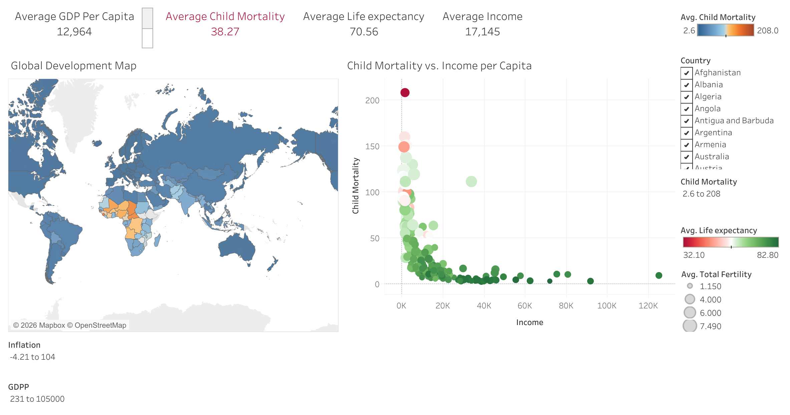
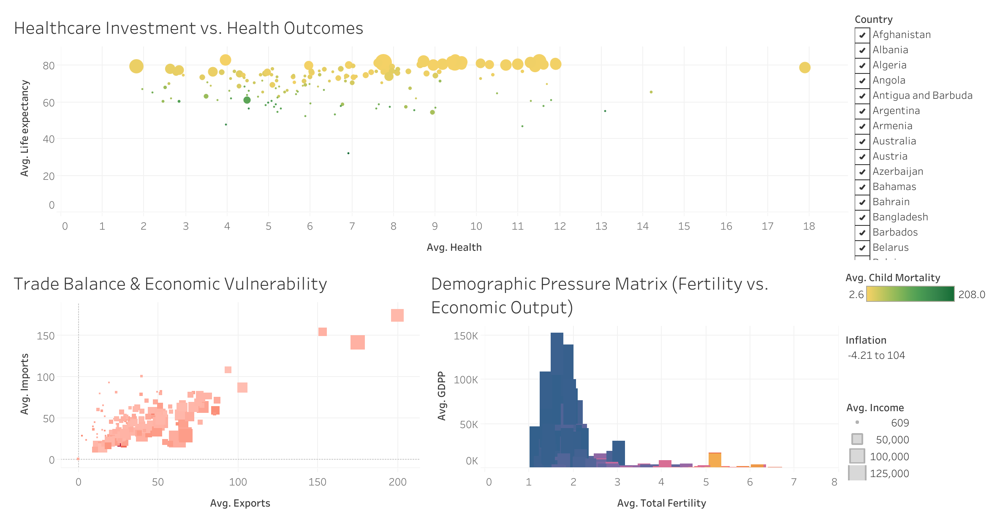

# HELP International: Global Socio-Economic & Development Analysis

## 📌 Interactive Dashboard Link
🔗 **[View Live Interactive Dashboard on Tableau Public](YOUR_TABLEAU_PUBLIC_LINK_HERE)**

---

## 📊 Dashboard Previews

### 1. Executive Overview & Need Matrix
Identifies priority countries in critical economic distress based on GDP, child mortality, and net income metrics.

### 2. Structural Drivers & Economic Vulnerability
Evaluates health expenditure efficiency, trade balances (exports vs. imports), and demographic fertility pressure.

---

## 💡 Key Analytical Findings
* **Critical Intervention Quadrant:** Countries with low GDP per capita (< $2,000) and child mortality rates exceeding 50 per 1,000 require immediate aid allocation.
* **Health Spending Paradox:** Increased healthcare allocation as a % of GDP does not yield proportional improvements in life expectancy unless core economic infrastructure (income) is stabilized.
* **Trade Exposure:** Emerging nations experiencing high inflation (>15%) demonstrate strong import dependency over export capacity.

---

## 🛠️ Data Architecture
* **Tool:** Tableau Desktop / Tableau Public
* **Source:** Kaggle - *Country Development Data (HELP International)*
